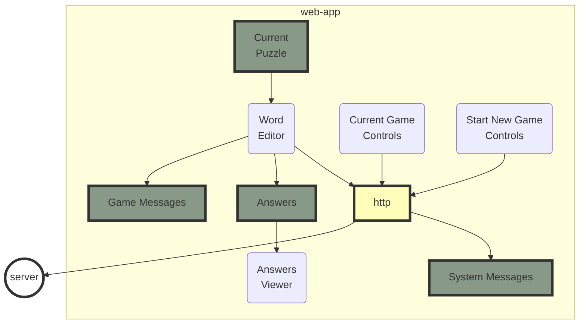
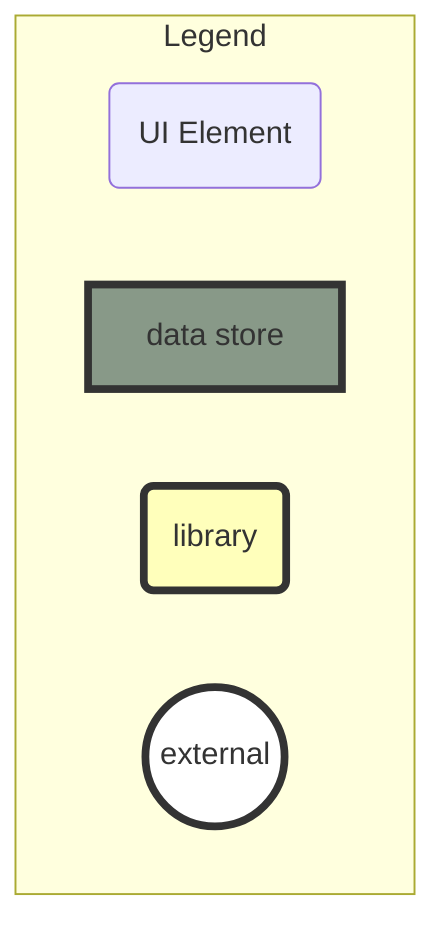

# license-plate-game-aurelia

This is a web-app for a license-plate word game.  
This was built with the [Aurelia](https://aurelia.io/) application framework.  
_The server is under development and is not open source._

Here is a [development deployment](http://radiant-hamlet-54079.herokuapp.com/).  
This server may be sleeping, in which case it will take 20 seconds to restart.

This video shows an example puzzle session:

https://user-images.githubusercontent.com/940931/160249859-00d26f0b-ba52-48e5-a1b5-80cbb583d4ec.mov

# Game Rules
- Words must contain the original three characters, in the order in which they were given.  
- Words may consist of only letters.  
Punctuation is not supported yet.  
For example, words such as "don't", "check-in", or "full moon" are not accepted as solutions.
- Words may only be single words, and not compounds.
- Words may be up to 15 characters long.  
Longer words are not supported due to UI contraints.

# Game Features
- The server only provides puzzles with known solutions.
- All puzzles are graded for difficulty.
- The server provides simple puzzles, until directed by the web-app to provide more difficult ones.
- The server is stateless.
- The server doesn't track the user.
- The web-app doesn't collect any user data, and doesn't use cookies.

# Web-App Features

- The web-app uses a compact UI on a realistic license plate.
- Character input supports normal key entry and navigation, along with drag-and-drop.
- If the user attempts to delete one of the original three puzzle characters, the web-app prevents the change and signals the error with an animated color change.
-The communication status with the server is shown in the top section of page.  
These messages time-out as appropriate.
- The user may request a new game, optionally specifying the characters for the puzzle.
- The user may request hints.  
Each hint randomly shows the pattern for a single known solution.
- Recent answer results and hints are displayed in the bottom portion of the license plate, just below the main text input area.  
These messages time-out as appropriate.
- Answers are lised in a separate view displayed over the same license plate image.
- Answers are scored with Boggle and Scrabble scores.
- The difficulty of the correct answers for the current puzzle is used to select the difficulty of the following puzzle.
- A menu button (in the upper left) contains:
  - An about button that allows the user to pick a version of the web-app built with a different application framework.  
  Currently there are four versions of this web-app, each built with a different framework.  
  They are: plain HTML+CSS+JS (no framework), React JS, Vue.js, and this one with Aurelia.
  - A feedback button allows the user to pick a version of the web-app built with a different application framework.

# Known Issues

- The background doesn't display correctly on mobile devices.
- Duplicate messages may be displayed in either message area.
- The hamburger menu has inconsistent style.
- The New Game Controls should display a completion messgae for a few seconds immediately after a new game is started.
- There is no way for the user to contest a word.

# Design

The basic architecture of the web-app is shown in the diagram below.  
The diagram elements are linked to the code that is primarily responsible for that block -- so click on them!

NOTE: This diagram is rendered from a [mermaid.js](https://mermaid.live/edit#pako:eNqVk8luwjAQhl_FMpcgmRM90LSq1ELVU6tKVO2BIOTEE7BInGjsEBbx7nVsgxA9tM3Fs3z_zMTLgWaVABrTRC2R1yvy8ZQoYj_dpD7QQjrgde2jQiJkRlbqzIGQpsLoq0Jxn-LDs3P7ZDB4ICtj6kvIBR-VbgG1jwfHJbi3FxsJbRQSXcVP6wP2vaBu9vsCZuMGEZTp0u8uMnclfBtPZh6JAkpeeAkdP66UwarQ1yMq23VqOBryBu2vdGe5kN7pRamXejbdaQMleQWt-RL0_MePL21Jj3bFr8FzwayQdtygViJR1w0BN4BR5Nd-_wRkBdd6AjkR3HCSy6KIe6PbEdN2_jXEveFwGOxBK4VZxTf19u5K6msGcZ7n_xIXMkWOu7M6_bPajcz80bJw8uy0sey8bw67lMHWACpesDC3Xy6JMBNzuxecRFFGS8CSS2Hv_aHjE2pWUEJCY2sKjuvEvoej5ZraNgV_qWlssAFGeWOq6U5lJ98zE8nteyl98PgNV00iiw) diagram text description embedded in this ReadMe.

Legend for the styles used in the above diagram:

## Components for the above Design Diagram
- UI Elements  
Note that the TypeScript is in the sibling file of the same basename.
  - [Word Editor](./src/LicensePlateSolutionEditorFreeEntry.html)
  - [Current Game Controls](./src/CurrentGameControls.html)
  - [Start New Game Controls](./src/StartNewGameControls.html)
  - [Answers Viewer](./src/AnswersTable.html)
- Data Stores  
  - [Current Puzzle](./src/PuzzleSummary.ts)
  - [Answers](./src/AnswersTable.html)
  - [Game Messages](./src/GameStatusMessagesSignboard.html)
  - [System Messages](./src/SystemStatusMessagesSignboard.html)
- Libraries  
  - [http](https://github.com/psnider/license-plate-game-api)

# Testing

Since this was a project for me to learn Aurelia,
I didn't get around to writing tests.

If this web-app winds up being something that I use for a production deployment, then I'll add appropriate tests then.
In the meantime, I'll revisit both the ReactJS and Vue.js web-apps, and I may even consider other frameworks, such as Svelte and Hyper-HTML.
## Two main test categories
I like to divide tests into two groups:
- independent of the network  
These test all normal computation, and use mocks to test local code.
- requires the internet  
This may have dependencies on external services, which may fail.

I like test frameworks that support alternatives to pass/fail.  
For example, mocha support skip(), which causes tests to show up in test results, but as not having been run.

# So, what about Aurelia?
I really like the core idea of Aurelia: **Use standard HTML + JavaScript!**  
- HTML with binding to JavaScript class variables.
- Plain JavaScript with decorators.  

No special languages required!  Just standard HTML and standard JavaScript. No *.vue files, no *.jsx or *.tsx files.  
And, as such, it supports TypeScript.  

In practice, Aurelia works pretty well, but has a few shortcomings:
- The documentation is incomplete.  
This also includes general information on the web, such as examples and Stack Overflow questions.
- The TypeScript support is good, but not great.  
Errors in required filenames are not flagged.  This can cause a fair bit of pain.
- There appear to be only a few maintainers.  
The project moves along very slowly.  
This is the 3rd time I tried Aurelia!  
Both of the earlier times, my project wound up dying due to tooling and documentation problems.
- It's easy to confuse Aurelia v1 and v2 documentation.  
But this is also true of React JS and Vue.js, which both have a number of complicating revisions.

